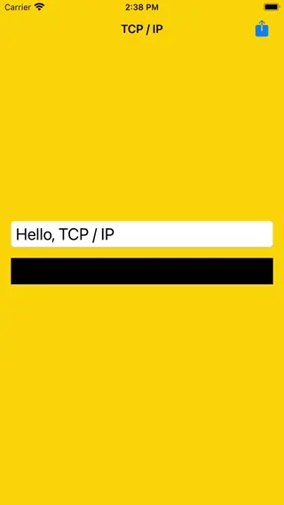

# WWTcpConnection
[](https://developer.apple.com/swift/) [](https://developer.apple.com/swift/)  [](https://developer.apple.com/swift/) [](https://developer.apple.com/swift/)

### [Introduction - 簡介](https://swiftpackageindex.com/William-Weng)
- [TCP/IP client connection tool.](https://www.appcoda.com.tw/network-framework-http/#google_vignette)
- [TCP / IP 客戶端連線工具。](https://www.appcoda.com.tw/network-framework/)



### [Installation with Swift Package Manager](https://medium.com/彼得潘的-swift-ios-app-開發問題解答集/使用-spm-安裝第三方套件-xcode-11-新功能-2c4ffcf85b4b)
```bash
dependencies: [
    .package(url: "https://github.com/William-Weng/WWTcpConnection.git", .upToNextMajor(from: "1.0.3"))
]
```

### [Function - 可用函式](https://ezgif.com/video-to-webp)
|函式|功能|
|-|-|
|state()|當前連線狀態|
|create(minimumLength:maximumLength:delegate:)|建立連線|
|cancel()|取消連線|
|sendMessage(_:using:)|傳送文字訊息 (APP => TCP)|
|sendData(_:)|傳送資料訊息 (APP => TCP)|

### [WWTcpConnectionDelegete](https://ezgif.com/video-to-webp)
|函式|功能|
|-|-|
|connection(_:state:)|網路連線狀態|
|connection(_:error:)|相關錯誤狀態|
|connection(_:sendContent:state:)|傳送內容訊息|
|connection(_:receiveData:state:)|接收回傳訊息|

### Example
```swift
import UIKit
import Network
import WWPrint
import WWTcpConnection

final class ViewController: UIViewController {

    @IBOutlet weak var myTextField: UITextField!
    @IBOutlet weak var myLabel: UILabel!
    
    let connection = WWTcpConnection(host: "127.0.0.1", port: 8080)
    
    override func viewDidLoad() {
        super.viewDidLoad()
        connection.create(delegate: self)
    }
    
    @IBAction func send(_ sender: UIBarButtonItem) {
        connection.sendMessage(myTextField.text!)
    }
}

extension ViewController: WWTcpConnectionDelegete {
    
    func connection(_ connection: WWTcpConnection, state: NWConnection.State) {
        wwPrint(state)
    }
    
    func connection(_ connection: WWTcpConnection, error: WWTcpConnection.ConnectionError?) {
        wwPrint(error)
    }
    
    func connection(_ connection: WWTcpConnection, sendContent contentType: WWTcpConnection.ContentType, state: NWConnection.State) {
        wwPrint(contentType)
    }
    
    func connection(_ connection: WWTcpConnection, receiveData data: Data, state: NWConnection.State) {   
        DispatchQueue.main.async { self.myLabel.text = String(data: data, encoding: .utf8) }
    }
}
```

